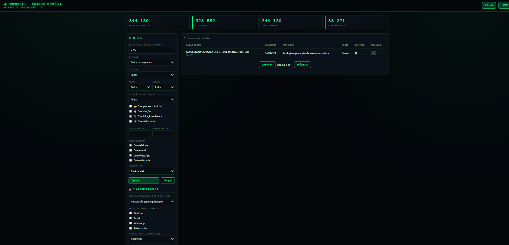
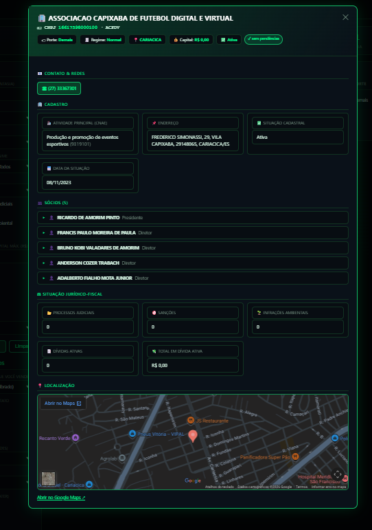

<div align="center">

# 🗺️ Dataset de Empresas da Grande Vitória (ES)

### A base aberta mais completa de empresas ativas do Espírito Santo — pronta para prospecção, pesquisa e análise de mercado.

**351 mil empresas ativas** de **7 municípios**, cruzando dados cadastrais, **sócios**, jurídicos, sanções, dívida ativa, infrações ambientais e **flags de risco** (trabalho escravo, CEPIM, leniência) — tudo de **fontes públicas oficiais**. Com **mapa interativo**, **dashboard**, **API REST**, **MCP** (Claude) e **classificação de leads**.

<br>

[](#)
[](#)
[](#)
[](#-consumir-o-dataset)
[](#-consumir-o-dataset)
[](#-projeto-em-construção)

<br>

<a href="https://github.com/sponsors/brunokobi">
  
</a>

<sub>Projeto aberto e sem fins lucrativos — seu apoio custeia o pipeline rodando 24/7 e o dataset atualizando sozinho a cada 2h.</sub>

<br><br>

### ⭐ Se este projeto te for útil, **deixe uma estrela** — leva 1 segundo, é de graça e ajuda demais a dar visibilidade ao trabalho!

</div>

---

## 🌐 Acesse online (sem instalar nada)

| | |
|---|---|
| 🖥️ **Dashboard** | **[empresas.brunokobi.duckdns.org](https://empresas.brunokobi.duckdns.org)** |
| 🔌 **API REST** | [empresas.brunokobi.duckdns.org/docs](https://empresas.brunokobi.duckdns.org/docs) |
| 🤖 **MCP** (Claude, Cursor, Windsurf, VS Code, Cline...) | `https://empresas.brunokobi.duckdns.org/mcp/` — instruções por cliente em **[MCP.md](MCP.md)** |

---

## ⚡ Começar em 1 comando

O dataset é distribuído como **GitHub Release** (não fica versionado no repo — mantém tudo leve). O script de setup usa o [uv](https://docs.astral.sh/uv/) para criar o ambiente com um Python 3.12 isolado (instalando o próprio uv se preciso), instalar dependências e **baixar o dataset** — **não precisa ter Python pré-instalado**, nem depende da versão que o sistema operacional já traz.

**Linux, macOS ou WSL:**

```bash
git clone https://github.com/brunokobi/projeto_grande_vitoria_empresas.git
cd projeto_grande_vitoria_empresas
bash setup.sh
source .venv/bin/activate
uvicorn api:app        # http://localhost:8000
```

**Windows (PowerShell nativo, sem precisar de WSL):**

```powershell
git clone https://github.com/brunokobi/projeto_grande_vitoria_empresas.git
cd projeto_grande_vitoria_empresas
powershell -ExecutionPolicy Bypass -File setup.ps1
.venv\Scripts\Activate.ps1
uvicorn api:app        # http://localhost:8000
```

Pronto: **dashboard** em `http://localhost:8000`, **API** em `/docs`, e o **MCP** detectado pelo Claude Code (`.mcp.json`).

> **Nota (LGPD).** Os dados vêm de fontes públicas oficiais, mas o dataset consolida dados de pessoas (nomes de sócios, CPF mascarado, endereços). Use de forma responsável e conforme a LGPD.

---

## 📸 Telas

<div align="center">

**Dashboard — lista, filtros e mapa interativo**



**Visão 360º da empresa** — cadastro, sócios + rede, pendências detalhadas e mapa



</div>

---

## 🚧 Projeto em construção

Em desenvolvimento ativo. Estado atual:

| Componente | Status |
|---|---|
| Cadastro (Receita) · **Sócios** · JUCEES | ✅ pronto (**351.824 empresas ativas** em produção — snapshot 05/09/2026, cresceu de 344k após a Receita atualizar o universo via cron mensal na VPS) |
| Dívida ativa **PGFN** (detalhada) | ✅ pronto |
| Sanções federais **CEIS/CNEP** + estaduais **TCEES** | ✅ pronto |
| Infrações **IBAMA** (detalhadas) | ✅ pronto |
| **CEPIM** (impedidas de verba federal) · **Acordos de Leniência** (CGU) | ✅ pronto |
| **Lista Suja do trabalho escravo** (MTE) | ✅ pronto |
| **Mapa interativo** (MapLibre) + **satélite** na visão 360º | ✅ pronto |
| Geocodificação (coordenadas de todas as empresas) | ✅ **100% concluído em produção** (351.824/351.824 — conferido ao vivo em 05/09/2026) |
| Processos judiciais (**DJEN/CNJ**, por nome da parte) | ✅ **3,12 milhões de processos publicados em produção**, **148.870 empresas** com algum processo encontrado (qualquer polo) — a consulta roda numa máquina local (ver nota), **97,8% do universo atual já consultado** (344.124/351.824 — a base local foi sincronizada com a Receita em 05/09/2026, cobrindo as empresas mais novas) |
| Contato & redes sociais (WhatsApp, site, Instagram…) | 🧪 implementado |
| Dashboard · API · MCP · export Excel/PDF | ✅ funcionais |
| **Classificação de leads** (via API/MCP) | ✅ funciona — 🚧 removida temporariamente da UI do dashboard |
| **Mapa: Unidades de Conservação/Zona de Amortecimento** (MMA/CNUC + IEMA-ES) | ✅ pronto — camada no mapa + filtro/badge: **10.194 empresas** dentro de UC/zona de amortecimento (rodado contra o universo atual, 351.824 empresas) — entrou no cron mensal, atualiza sozinho todo mês |
| **Mapa: proximidade ambiental** (fiscalização IDAF/IEMA, barragem IDAF, outorga AGERH) | ✅ pronto — camada no mapa + filtro/badge: **83.052 empresas** a até 500m de um ponto ambiental — mesma cobertura/atualização automática acima |

> 🔄 **Atualização automática:** o dataset publicado (Release) é atualizado
> **a cada 2 horas** — o dashboard/API baixam a versão nova sozinhos, sem
> precisar de reinstalação. O cadastro base (Receita Federal) e as demais
> fontes rodam mensalmente numa VPS; **processos judiciais (DJEN)** roda à
> parte, continuamente, numa máquina local (rate limit externo — não dá
> pra paralelizar numa VPS sem violar o limite da API pública do CNJ).
>
> ✅ **Geocodificação** já terminou (100%, dependia do OpenStreetMap a ~1
> req/s). No mapa, qualquer empresa sem coordenada (ex.: cadastro novo do
> mês) ainda é localizada **na hora pelo endereço**, como fallback.
>
> ⚖️ **Processos judiciais:** a API pública do DataJud **não expõe as partes**
> (CPF/CNPJ), então é impossível achar processos por empresa por ela. Em vez disso
> usamos o **DJEN / Comunica API do CNJ** (busca por nome da parte) — cobre
> litígio recente (era do DJEN, ~2022+).

---

## 💼 O que você recebe

| | |
|---|---|
| 🏢 **Cadastro** | CNPJ, razão social, CNAE (por nome), porte, regime, capital, endereço, situação |
| 👥 **Sócios + rede** | Quadro societário (nome, qualificação, faixa etária) e **em quais outras empresas o mesmo sócio aparece** |
| ⚖️ **Situação jurídico-fiscal detalhada** | Dívida ativa (tipo de tributo, ajuizamento, risco), sanções federais/estaduais (fundamentação, valor da multa), infrações IBAMA (valor, gravidade), processos (DJEN, com **link direto pro Jusbrasil**), contratos públicos e renúncia fiscal — **cards com total em R$ de cada categoria**, só exibidos quando a empresa tem algum resultado |
| 🚩 **Flags de risco** | **Lista Suja do trabalho escravo** (MTE), **CEPIM** (impedidas de verba federal), **acordos de leniência** — filtráveis |
| 📄 **Contratos públicos** | Contratos federais (Portal da Transparência): órgão, objeto, valor, vigência |
| 🗺️ **Mapa interativo** | Mapa geral da Grande Vitória com todos os pontos (clique → empresa) e **satélite** na visão 360º; filtros recortam o mapa |
| 🧭 **Enriquecimento** | Geolocalização e contato/redes sociais |
| 🎯 **Classificação de leads** | Questionário por objetivo comercial → score 0–100 (🔥 Quente / 🙂 Morno / ❄️ Frio) |
| 🔌 **Acesso** | Dashboard web, API REST, servidor MCP (Claude), export Excel e PDF |

---

## 🔗 Fontes de dados cruzadas

Tudo cruzado pelo **CNPJ**, exclusivamente de **fontes públicas oficiais**:

| Fonte | O que agrega | Status |
|---|---|:--:|
| **Receita Federal** (CNPJ) | Cadastro, **sócios**, CNAE, porte, capital, endereço | ✅ |
| **JUCEES** (dados.es.gov.br) | NIRE, constituição, natureza jurídica | ✅ |
| **PGFN** | Dívida ativa (tipo de tributo, valor, ajuizamento) | ✅ |
| **CGU** — Portal da Transparência | Sanções **CEIS/CNEP**, **CEPIM**, **Acordos de Leniência** | ✅ |
| **TCEES** | Sanções estaduais (processo/deliberação) | ✅ |
| **IBAMA** | Infrações ambientais (valor da multa, gravidade, situação) | ✅ |
| **MTE** — Cadastro de Empregadores | **Lista Suja** do trabalho escravo | ✅ |
| **OpenStreetMap / Nominatim** | Geolocalização (mapa; fallback por endereço) | ✅ |
| **DJEN / CNJ** (Comunica API) | Processos judiciais (por nome da parte) | 🚧 |
| **CGU** — Portal da Transparência | **Contratos com órgãos públicos federais** (objeto, valor, vigência) | ✅ |
| **PNCP** (Portal Nacional de Contratações Públicas) | **Contratos municipais, estaduais e federais** (unificados desde 2023 — cobertura bem maior que o Portal da Transparência) | ✅ |
| **CGU** — Portal da Transparência | **Renúncias/Benefícios Fiscais federais** (valor por ano, imunidade/isenção IRPJ, habilitação) | ✅ |
| **SEDES-ES** — Programa COMPETE-ES | **Incentivo fiscal de ICMS estadual** (portaria de habilitação, vigência, exclusão) | ✅ |
| **INPI** | **Marcas registradas** (sinal indireto de atividade/inovação) | ✅ |
| **TSE** | **Vínculo político do sócio** — candidaturas e doações eleitorais declaradas em 2016/2018/2020/2022/2024 (municipal e geral, cruzado por nome+CPF mascarado) | ✅ |
| **MMA/CNUC + IEMA-ES** (WFS GeoBases-ES) | **Unidade de Conservação/Zona de Amortecimento** — empresa geolocalizada dentro do polígono (identidade, point-in-polygon) | ✅ |
| **IDAF/IEMA + AGERH/ANA** (WFS GeoBases-ES) | **Proximidade ambiental** — fiscalização grave, barragem e outorga hídrica a até 500m (proximidade; barragem também por nome do interessado quando bate com sócio) | ✅ |

> A construção/atualização do dataset é feita por um pipeline de extração mantido em repositório separado. Este é o **produto de consumo** — o histórico completo de fontes já testadas (implementadas e descartadas, com o motivo de cada descarte) fica documentado lá, não aqui.

---

## 🖥️ Consumir o dataset

Lógica de consulta compartilhada (`src/dataset_queries.py`) entre dashboard, API e MCP — todos leem o SQLite em **somente-leitura**.

### Dashboard web
`uvicorn api:app` → **http://localhost:8000**. **Mapa geral** da Grande Vitória (MapLibre GL, fundo vetorial [OpenFreeMap](https://openfreemap.org/) — gratuito, sem API key) com todos os pontos geolocalizados — clique num ponto abre a empresa. 5 **abas independentes** sobre o mapa — **Empresas**, 🚨 **Crime**, 🏘️ **Bairros**, 🌳 **UC** e 🌱 **Ambiental** — cada uma liga/desliga sua própria camada sem mexer nas outras, dá pra combinar quantas quiser ao mesmo tempo (não é mais grupo exclusivo tipo rádio; modo "Risco" por município fica temporariamente fora da UI, lógica comentada no código pra reativar rápido se precisar). **Crime** mostra um **choropleth de ocorrências criminais por bairro** (furto/roubo/estelionato — SESP-ES, 2018–2026, dado agregado — a fonte não traz coordenada exata, só município+bairro) **sem esconder os pontos das empresas**, que continuam visíveis por cima quando as duas abas estão ligadas. **Bairros**: limites de bairro (fonte: [IJSN/GeoBases-ES](https://ide.geobases.es.gov.br/), Projeto Bairros, 2012 — sem atualização mais recente na origem, é referência visual — nome do bairro aparece a partir do zoom 12). **UC**: Unidades de Conservação/Zonas de Amortecimento (fonte: MMA/CNUC + IEMA-ES via GeoBases-ES — 38 UCs federais/estaduais/municipais + 2 zonas de amortecimento que tocam a Grande Vitória). **Ambiental**: fiscalização/autuação IDAF+IEMA (1.963 pontos), barragens licenciadas/dispensadas IDAF (346) e outorgas de recursos hídricos AGERH/ANA (490), tudo via GeoBases-ES — são pontos de **proximidade**, a fonte pública não traz CNPJ/nome do autuado ou outorgado. E os filtros recortam o mapa (payload enxuto: só os campos que o mapa desenha, sem inflar o JSON a cada filtro aplicado). Filtros (CNPJ, busca, sócio, segmento CNAE, **município com seleção múltipla**, porte, regime, tipo de pendência, acordo de leniência, capital, contato/redes) — cada checkbox de pendência **só aparece quando tem resultado** (some se zerado). Trabalho escravo (MTE) e CEPIM não são mais checkboxes soltos — viraram opções do submenu de tipo em "Com sanções administrativas" (evita duplicar o mesmo filtro em dois lugares). **"Dentro de Unidade de Conservação"** (identidade — empresa geolocalizada CAI dentro do polígono da UC/zona de amortecimento, point-in-polygon pré-computado) e **"Perto de ocorrência ambiental"** (fiscalização grave/barragem/outorga a até 500m — proximidade, não identidade, exceto barragem quando o nome do interessado bate com sócio da empresa) são dois filtros novos que **não contam como pendência jurídico-fiscal** (são contexto, não sanção). "Em processo judicial", "Com sanções administrativas", "Com benefício fiscal", "Vínculo político (sócio)" e "Contrato via PNCP" têm **submenu de refinamento com seleção múltipla** (polo do processo — réu/autor/terceiro — e classe; tipo de sanção; tipo de benefício fiscal — renúncia/imune-isento/habilitado/incentivo ICMS; fonte do vínculo — doação/candidatura; categoria do contrato PNCP) que também filtra a lista exibida no modal da empresa, sem afetar o resumo/pendência (que sempre reflete o total real, inclusive os valores em R$ somados). Nesses 5 submenus, marcar mais de um valor é **"E" (AND), não "OU"**: marcar "Doação eleitoral" **e** "Candidatura" busca só empresas cujo sócio tenha registro dos **dois** tipos (não qualquer um dos dois) — diferente do filtro de município (esse sim é "OU": marcar Vitória + Serra traz empresas de qualquer uma das duas). O resumo/pendência sempre reflete o total real, e a lista do modal mostra todos os registros dos tipos marcados (já que a empresa exibida garantidamente tem pelo menos 1 de cada). **Visão 360º** por empresa com **cards expansíveis** (processos com link direto pro Jusbrasil, dívida, sanção, infração e sócios detalhados), **cards de resumo** cobrindo todas as categorias (quantidade + valor total em R$ quando aplicável, layout que nunca deixa espaço vazio nem passa de 3 linhas), **tag de idade da empresa** (constituição JUCEES ou situação cadastral), **link direto pra empresa via URL** (`?empresa=<cnpj>`, com botão de copiar) + **mapa por satélite**, **export Excel/PDF** e **ranking de doações eleitorais** (candidatos que mais receberam e empresas que mais aparecem doando, por quantidade ou valor).

> A **classificação de leads** (questionário → score 0–100) segue disponível via API (`GET /classificar`) e MCP (`classificar_empresas`) — só foi tirada temporariamente da interface do dashboard.

> **Importante (deploy na VPS)**: `/app/data` é um **bind mount persistente** do Coolify — `start.sh` só baixa o dataset na PRIMEIRA vez que o diretório está vazio; um **redeploy sozinho não atualiza o dataset**, ele só reconstrói a imagem/código. Quem mantém o dataset em dia é a **Scheduled Task do Coolify** rodando `refresh_dataset.py` a cada 2h (troca o arquivo atomicamente via `os.replace`, sem downtime). Se precisar do dado mais recente ANTES do próximo ciclo de 2h (ex.: pra validar uma fonte nova recém-publicada), rode manualmente dentro do container: `docker exec <container> python3 refresh_dataset.py`.

### API REST (FastAPI) — docs em `/docs`
- `GET /estatisticas` · `GET /segmentos`
- `GET /vinculos/ranking-doacoes` — ranking de doações eleitorais (TSE): candidatos que mais receberam e empresas que mais aparecem doando, por quantidade ou valor
- `GET /empresas` — busca com filtros (município, `cnae_prefix`, porte, regime, `socio` (nome), `tem_pendencia`, `com_processos`/`com_sancoes`/`com_ambiental`/`com_divida`, `com_trabalho_escravo`/`com_cepim`/`com_leniencia`/`com_contratos_governamentais`/`com_contrato_pncp`/`com_beneficio_fiscal`/`com_incentivo_estadual`/`com_marca_registrada`/`com_vinculo_politico`/`com_unidade_conservacao`/`com_ambiental_proximidade`, `com_telefone`/`com_email`/`com_whatsapp`/`com_rede_social`, capital, ordenação, paginação) — `processo_polo`/`processo_classe` refinam `com_processos`; `sancao_tipo`/`sancao_orgao` refinam `com_sancoes`; `beneficio_tipo` refina `com_beneficio_fiscal` (RENUNCIA/IMUNE_ISENTO/HABILITADO/COMPETE_ES — os antigos `com_renuncia_fiscal`/`com_imune_isento`/`com_habilitado_beneficio` continuam funcionando à parte, por compatibilidade); `vinculo_fonte` refina `com_vinculo_politico` (TSE_DOACAO/TSE_CANDIDATURA); `pncp_categoria` refina `com_contrato_pncp`; `ambiental_proximidade_tipo` refina `com_ambiental_proximidade` (fiscalizacao/barragem/outorga) — `processo_polo`/`processo_classe`/`sancao_tipo`/`beneficio_tipo`/`vinculo_fonte`/`pncp_categoria`/`ambiental_proximidade_tipo` aceitam **múltiplos valores** (repita o parâmetro na querystring, ex. `?vinculo_fonte=TSE_DOACAO&vinculo_fonte=TSE_CANDIDATURA`) — 2+ valores é **"E"**, exige que a empresa tenha registro de CADA valor informado, não só de algum (diferente de `municipio`, que é "OU")
- `GET /processos/classes` · `GET /sancoes/orgaos` — valores disponíveis pra `processo_classe`/`sancao_orgao`, com contagem
- `GET /empresas/perto` — busca por **raio (km) a partir de um ponto** (`lat`/`lon`), ordenado por distância, combinável com os mesmos filtros de `/empresas`
- `GET /mapa` — pontos geolocalizados (lat/lng) com os mesmos filtros, para o mapa
- `GET /empresas/{cnpj}` — visão 360º (cadastro, sócios+rede, pendências detalhadas, geo)
- `GET /geocode` — resolve um endereço em lat/lng (fallback do mapa quando a empresa ainda não tem coordenada; combine com `/empresas/perto` pra buscar por endereço)
- `GET /classificar` — pontua e ranqueia leads por objetivo comercial
- `GET /export/empresas.xlsx` · `GET /export/empresas.pdf`
- `GET /robots.txt` · `GET /sitemap.xml` · `GET /og-image.png` — SEO/indexação (ver seção abaixo)

### SEO / indexação em buscadores
O dashboard tem meta description/keywords, `robots.txt`+`sitemap.xml`, Open Graph/Twitter Card (preview de link) e um bloco **JSON-LD schema.org/Dataset** — esse último é o que alimenta o [Google Dataset Search](https://datasetsearch.research.google.com/). Nada disso muda o layout: são só tags no `<head>` do `dashboard/index.html` e 3 rotas novas na API.

### Servidor MCP
Ferramentas `estatisticas`, `buscar_empresas`, `buscar_empresas_perto` (busca por raio — aceita coordenada ou um **endereço em texto livre**, geocodificado automaticamente), `obter_empresa`, `classificar_empresas`, `ranking_doacoes_eleitorais` para o Claude e outros clientes MCP. Duas formas de conectar: **remoto**, direto em `https://empresas.brunokobi.duckdns.org/mcp/` (sem instalar nada); ou **local**, via `.mcp.json` (detectado automaticamente pelo Claude Code após o `setup.sh`).

`obter_empresa` já devolve um `resumo` agregado (mesma lógica dos cards do dashboard) com quantidade **e** valor total em R$ de cada categoria — processos, sanções, infrações ambientais, dívida ativa, contratos públicos, renúncia fiscal e contratos PNCP — além do **link direto pro Jusbrasil** em cada processo (`url_jusbrasil`). É dado suficiente pra pedir ao Claude (ou outro cliente MCP) **"me dá um parecer completo dessa empresa"** e receber uma análise em cima de tudo isso, sem precisar cruzar nada manualmente.

📘 **Tutorial completo de conexão** (Claude Desktop, Claude Code, Cursor, Windsurf, VS Code/Copilot, Cline): **[MCP.md](MCP.md)**.

---

## 💛 Apoie o projeto

[](https://github.com/sponsors/brunokobi) · níveis em [](SPONSORS.md)

## 💬 Contato, sugestões e contribuições

| Quero... | Como |
|---|---|
| 🔗 Sugerir nova fonte de dados | [](https://github.com/brunokobi/projeto_grande_vitoria_empresas/issues/new?template=nova-fonte.yml) |
| 💡 Sugestão, melhoria ou pedido | [](https://github.com/brunokobi/projeto_grande_vitoria_empresas/issues/new?template=sugestao.yml) |
| 🐞 Problema ou reclamação | [](https://github.com/brunokobi/projeto_grande_vitoria_empresas/issues/new?template=problema.yml) |
| 📧 Falar direto | [](mailto:brunokobi2@hotmail.com) |
| 🌐 Site / portfólio | [](https://brunokobi.netlify.app) |

---

<div align="center">
<sub>Feito com 💛 no Espírito Santo · Dados de fontes públicas oficiais · Use conforme a LGPD</sub>
</div>
